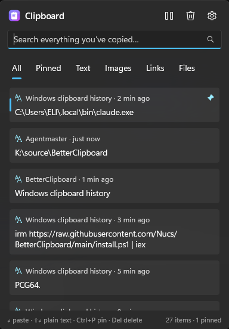

# BetterClipboard

**The Win+V clipboard history Windows should have shipped.** Same shortcut, same panel by your cursor —
but it remembers everything, survives restarts, searches instantly, and keeps it all encrypted on your PC.

[](https://github.com/Nucs/BetterClipboard/actions/workflows/ci.yml)
[](https://github.com/Nucs/BetterClipboard/releases/latest)
[](LICENSE)

<p align="center">
  
</p>

| | Windows' Win+V | BetterClipboard |
|---|---|---|
| History size | 25 items | 10,000 items (configurable, plus a size budget) |
| After a restart | **Gone** (only pinned items survive) | Everything is still there |
| Item size | ≤ 4 MB | ≤ 64 MB (configurable) |
| Search | None | Instant substring search, any language |
| Content | Text, HTML, bitmaps | Text, rich text/HTML, links, colors, images with previews, copied files |
| Screenshots | Only what you copy | Also every [ShareX](https://getsharex.com) screenshot the moment it is saved, in its own tab |
| Organizing | Pins | Pins plus groups: drag cards onto your own icons; grouped items are kept like pins |
| At rest | Pinned items encrypted | Everything encrypted (ChaCha20-Poly1305), bound to your PC and account |

## Install

Windows 10 version 2004 or newer / Windows 11, x64 or ARM64. Nothing else to install (the release is
self-contained). In PowerShell:

```powershell
irm https://raw.githubusercontent.com/Nucs/BetterClipboard/main/install.ps1 | iex
```

The installer downloads the latest [release](https://github.com/Nucs/BetterClipboard/releases/latest) for
your architecture, **verifies its SHA-256**, installs per user into `%LOCALAPPDATA%\Programs\BetterClipboard`
(no admin rights), adds a Start menu shortcut, starts BetterClipboard with Windows and registers it under
*Settings › Apps › Installed apps*. Running it again updates in place; your history is never touched.

Options (pass them through a script block):

```powershell
& ([scriptblock]::Create((irm https://raw.githubusercontent.com/Nucs/BetterClipboard/main/install.ps1))) -TakeOverWinV
```

| Option | Effect |
|---|---|
| `-TakeOverWinV` | Tell Explorer to release Win+V (see [Taking over Win+V](#taking-over-winv)) and restart Explorer once. |
| `-AddToPath` | Put the install folder on your user PATH so terminals can run `bclip` (see [Command line](#command-line-for-scripts-and-ai-agents)). |
| `-Version 0.1.0` | Install a specific release instead of the latest. |
| `-InstallDir <path>` | Install somewhere else. |
| `-NoStartup` / `-NoShortcut` / `-NoLaunch` | Skip starting with Windows / the Start menu shortcut / launching after install. |
| `-Uninstall [-RemoveData]` | Remove the app (history is kept unless `-RemoveData`). |

Prefer doing it by hand? Download the zip for your architecture and `SHA256SUMS.txt` from the release,
check the hash (`Get-FileHash .\BetterClipboard-*.zip`), extract anywhere and run `BetterClipboard.exe`.

## Use

Press **Win+V**. The panel opens by your text cursor with the search box focused — just type.

| Key | Action |
|---|---|
| *type* | Search (substring, case-insensitive, Hebrew/CJK/emoji included) |
| `↑` `↓` `PgUp` `PgDn` | Move the selection |
| `Enter` / click | Paste into the app you came from |
| `Shift+Enter` | Paste as plain text |
| `Ctrl+1` … `Ctrl+9` | Paste the n-th item |
| `Ctrl+P` | Pin / unpin (pinned items ignore retention and "clear") |
| `Del` (or `Shift+Del` while searching) | Delete the item |
| `Ctrl+F` | Back to the search box |
| `Ctrl+G` | Show / hide the groups column (same as the bookmark button) |
| `Menu` / `Shift+F10` / right-click | Item menu: paste, paste as plain text, copy only, pin, groups (add / remove), open link / show in Explorer, delete |
| `Esc` | Clear the search, then close — focus returns to where you were |
| Drag any empty spot | Move the panel, like dragging a title bar (`Esc` while dragging puts it back). It opens by your cursor again next time. |

The tray icon opens the panel and Settings: shortcut, retention (items, days, size), what to record,
ignored apps, pause, theme, start with Windows, the command line, ShareX screenshots, and **Import from Windows**, which pulls
in everything Win+V still remembers — including its pinned items.

### Groups

Collect the things you reuse — snippets, addresses, links for a project — into groups.

- **Open the column:** the bookmark button next to Pause (or `Ctrl+G`). The panel widens to the left and a
  column of icons appears. The clipboard logo at the top is your whole history.
- **Make a group:** press **+** at the bottom, give it a name if you like, and pick an icon.
- **Fill it:** drag any card onto a group's icon. The card then shows that group's icon.
- **Open it:** click the icon, and the panel shows only that group's items (search and the filter tabs
  still work inside it). Click the icon again, or the logo, to go back to everything.
- **Take things out:** right-click a card → *Remove from …*, or use *Groups* in the same menu. Right-click
  a group's icon to rename it, change its icon or delete it. Deleting a group never deletes its items.

Items in a group are **kept like pinned items**: no retention limit (count, age, size) removes them and
*Clear* skips them. When an item leaves its last group, its retention clock starts over. It won't be
removed just because it is old, and it keeps its place in the list.

**Password managers are ignored out of the box.** *Ignored apps* comes filled with 46 password managers
and authenticator apps, 65 process names in all: 1Password, Bitwarden, KeePass, KeePassXC, LastPass,
Dashlane, Keeper, NordPass, Proton Pass, RoboForm, Enpass and many more. See the
[full list with sources](docs/password-managers.md). Delete any you do want recorded and they stay
deleted; updates only ever add names that are new to the catalog.

## Taking over Win+V

Explorer owns Win+V. BetterClipboard supports two ways to take it:

- **Default — no system change.** While BetterClipboard runs, a low-level keyboard hook intercepts Win+V
  before Explorer sees it. Exit BetterClipboard and Windows' own panel is back instantly.
- **Clean mode** (`-TakeOverWinV`, or *Settings › Release Win+V from Explorer*). Explorer is told not to
  register Win+V (`DisabledHotkeys` = `V`) and BetterClipboard registers it normally, so it also works
  while an elevated (admin) window is focused. Trade-off: while BetterClipboard isn't running, Win+V does
  nothing. Uninstalling gives Win+V back to Windows.

Any other shortcut works too (Settings › Shortcut).

## ShareX screenshots

With [ShareX](https://getsharex.com) installed, every screenshot it saves is in your history the moment the
file is written. The panel gets a **ShareX** tab holding those screenshots and everything you copied from
ShareX. Paste one with `Enter` like any other item.

- **Where it looks.** BetterClipboard reads ShareX's own settings:
  - the personal folder: portable mode, the `PersonalPath` registry value, or `PersonalPath.cfg`;
  - the screenshots folder: the custom path and its fallback;
  - the subfolder patterns: `%y-%mo` by default, plus per-hotkey folder overrides.

  It imports only from folders those patterns can produce, so other images saved nearby (a synced phone
  folder, say) stay out. `UploadersConfig.json`, where ShareX keeps upload credentials, is never opened.
- **Nothing half-written, nothing missed.** A file is read only after ShareX has finished writing it.
  Screenshots saved while BetterClipboard wasn't running arrive at its next start, up to the 100 newest.
  The first time, only new screenshots count; your existing archive is left alone.
- **Skipped:**
  - thumbnails;
  - GIF screen recordings and videos;
  - everything while *Pause capturing* is on.

  Add `ShareX` to *Ignored apps* to leave ShareX out entirely, or turn off *Settings › ShareX screenshots*.
- Screenshots that ShareX only uploads or only copies aren't files. The copies still arrive through
  normal clipboard capture and show up in the same tab. A picture that was both copied and saved is kept
  once.

## Command line for scripts and AI agents

`bclip` lets terminals, scripts and AI coding agents (Claude Code, Codex, Copilot CLI, …) work with your
history: list, search and grep it, read any item exactly as it was copied, put something back on the
clipboard, or wait for your next copy. It ships next to the app and asks the running BetterClipboard —
it never opens the encrypted history itself — and starts BetterClipboard in the background if needed.

**It is off by default.** Turn it on in *Settings › Command line (bclip)* and click *Add bclip to PATH*
(or install with `-AddToPath`). While it is on, any program running as you can read your clipboard history
through it — the same trust you already give those programs with your files. Other Windows accounts and
the network cannot connect, and each command is logged by name only, never with content.

| Command | What it does |
|---|---|
| `bclip list [-n 20] [-f pinned\|text\|images\|links\|files\|sharex] [-s 2h]` | Recent items: id (`*` = pinned), kind, age, source app, first line |
| `bclip search <words…>` | Items containing all the words (substring, any language) |
| `bclip grep [-i] <regex>` | Matching lines as `id:line: text`, like `grep -n` |
| `bclip get [ID \| -r N] [--format text\|html\|rtf\|files\|png] [-o FILE]` | An item's content, byte for byte (default: the latest); images need `-o file.png` |
| `bclip copy [ID] [--plain]` | Put an item back on the clipboard, like picking it in the panel |
| `bclip put <text>` or `… \| bclip put` | Copy text (or standard input) to the clipboard and the history |
| `bclip pin [ID]` · `unpin [ID]` · `delete ID` | Keep an item forever, release it, or delete it |
| `bclip wait [-t 60]` | Block until you copy something, then print it |
| `bclip status` | Version, item counts, capture statistics |

Add `--json` to any command for structured output (ids, kinds, times, source app, formats, grep matches).
Exit codes: `0` ok · `1` nothing found or timed out · `2` bad usage · `3` BetterClipboard unreachable or the
command line is off · `4` other error. `bclip help <command>` shows every option.

```powershell
bclip get                                 # what did I just copy?
bclip grep -i "exception|error" -s 1h     # errors copied in the last hour, as id:line: text
bclip search invoice --json               # structured results for an agent
bclip get 42 -o shot.png                  # an image, as a PNG file an agent can open
bclip wait -t 120                         # "copy the stack trace and I'll read it"
git diff | bclip put                      # hand text back to you on the clipboard
```

## How it works

- **Capture.** BetterClipboard listens with `AddClipboardFormatListener` — the same change notification
  Windows' own clipboard-history service uses (there is no "atomic, never miss" clipboard API in
  Windows; every consumer reads the clipboard right after being told it changed). It reads each change
  immediately on a high-priority thread.
  - **What was measured:** copies 2 ms apart or more are all captured, and at 1 ms nearly all. A program
    that copies in a tight loop overwrites its intermediate copies before anyone, Win+V included, can
    read them.
  - **What happens then:** BetterClipboard still gets the last copy and keeps an exact tally of the
    overwritten ones, shown in Settings › Capture reliability.
  - **Safety net:** a watchdog re-arms the listener if Windows ever stops delivering.
- **Privacy markers.** Copies flagged by apps as private (`ExcludeClipboardContentFromMonitorProcessing`,
  `CanIncludeInClipboardHistory = 0`, `Clipboard Viewer Ignore` — used by password managers) are never
  recorded. Many managers, Electron-based ones especially, don't set these flags. The ignored-apps list
  catches those by the name of the process that made the copy.
- **Storage.** One SQLite database, fully encrypted with [SQLite3 Multiple Ciphers](https://github.com/utelle/SQLite3MultipleCiphers)
  (ChaCha20-Poly1305: every page, the write-ahead log, the full-text index and thumbnails). Search uses an
  FTS5 trigram index on the decrypted pages in memory.
- **The key.** A random 256-bit key, stored only sealed with Windows DPAPI for your account, with extra
  entropy derived (HKDF-SHA256) from this PC's `MachineGuid` and your account's SID. The history folder
  name is a UUIDv5 computed from the same binding. Result: the history opens only for BetterClipboard, on
  this Windows installation, signed in as you. It protects the data at rest — stolen disks, backups,
  other accounts — but, like every DPAPI-based app, not against malware already running as you.
  A history that can no longer be decrypted (e.g. after reinstalling Windows) is set aside, never deleted.

Data lives in `%LOCALAPPDATA%\BetterClipboard` (`stores\<id>\history.db` + `history.key`, `settings.json`,
`logs\`). Logs never contain clipboard content.

The research behind all this — how Win+V is built (service `cbdhsvc`, the `TextInputHost` panel,
Explorer's hotkey), why it forgets, its on-disk format for pins, and the measurements quoted above — is
in [CLAUDE.md](CLAUDE.md).

## Uninstall

*Settings › Apps › Installed apps › BetterClipboard › Uninstall*, or:

```powershell
powershell -ExecutionPolicy Bypass -File "$env:LOCALAPPDATA\Programs\BetterClipboard\install.ps1" -Uninstall
```

Your history stays in `%LOCALAPPDATA%\BetterClipboard` unless you add `-RemoveData`.

## Build from source

Requires the [.NET 10 SDK](https://dotnet.microsoft.com/download/dotnet/10.0) on Windows.

```powershell
dotnet build BetterClipboard.sln
dotnet test --solution BetterClipboard.sln        # clipboard tests run in a private window station,
                                                  # so they never touch your real clipboard
pwsh tools/release/package.ps1 -Version 0.1.0     # the exact release zips + SHA256SUMS.txt
```

Set `BETTERCLIPBOARD_DATA_DIR` to a scratch folder when experimenting so your real history stays clean.
Releases are built by [`.github/workflows/release.yml`](.github/workflows/release.yml) from a `v*` tag.

## License

[MIT](LICENSE). Third-party components are listed in [THIRD-PARTY-NOTICES.md](THIRD-PARTY-NOTICES.md).
BetterClipboard is not affiliated with Microsoft.
