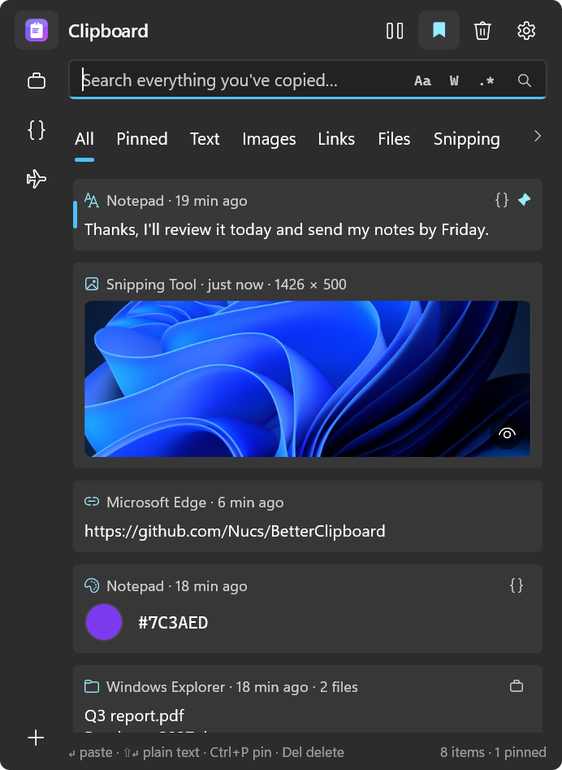
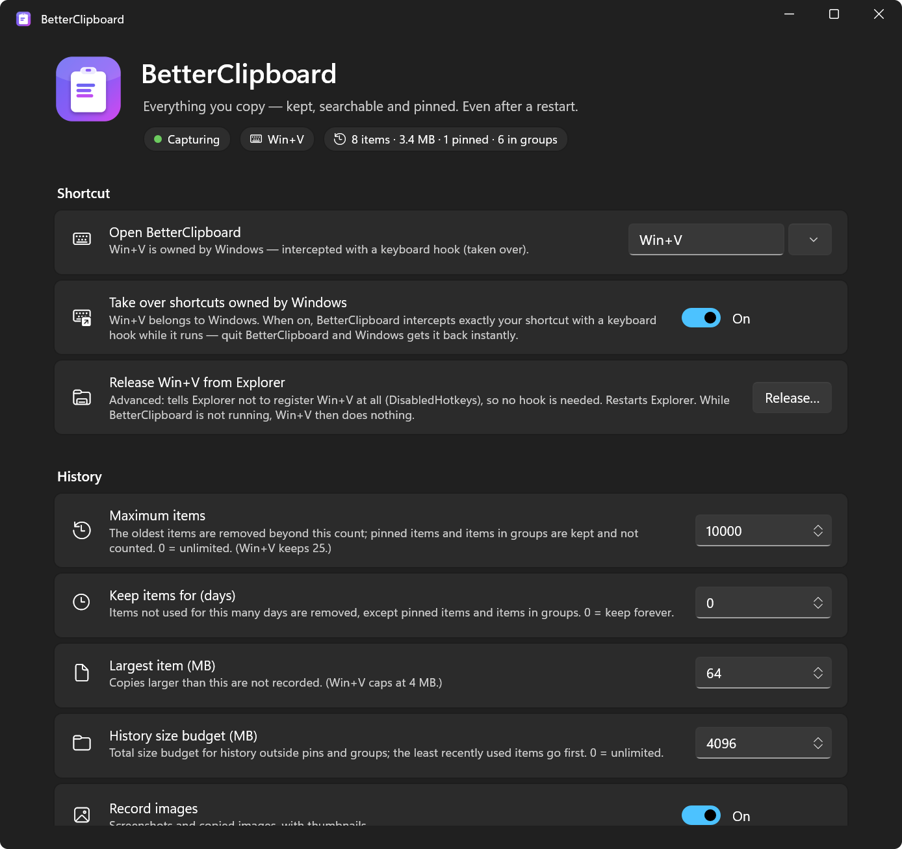
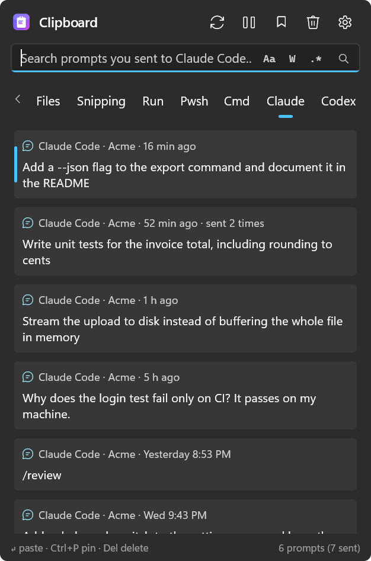

# BetterClipboard

**The Win+V clipboard history Windows should have shipped.** Same shortcut, same panel by your cursor —
but it remembers everything, survives restarts, searches instantly, and keeps it all encrypted on your PC.
It also keeps what other tools forget: your screenshots, your Win+R commands, your shell history and the prompts
you send to Claude Code and Codex.

[](https://github.com/Nucs/BetterClipboard/actions/workflows/ci.yml)
[](https://github.com/Nucs/BetterClipboard/releases/latest)
[](LICENSE)

<p align="center">
  
</p>

## Features

- **Takes over Win+V.** Same shortcut, and the panel opens by your text cursor. The installer releases Win+V from
  Explorer; a copy you run without the installer intercepts it with a keyboard hook. Add more shortcuts, or keep Win+V
  for Windows and pick your own: press any key or combination in *Settings › Shortcut* (numpad and media keys, F13–F24
  and the Copilot key included), and the shortcuts you used before stay one click away
  ([Choosing shortcuts](#choosing-shortcuts)).
- **Remembers everything, also after a restart.** 10,000 items by default, each up to 64 MB, with a size budget and an
  optional age limit, all adjustable. Win+V keeps 25 items of up to 4 MB, and a restart wipes all but its pins.
- **Every kind of copy**, with the source app and time on each card, and tabs that filter by kind and by source. A copy
  you make again moves to the top instead of adding a duplicate ([Tabs](#tabs)):
  - **Text, rich text and HTML, links, and colors** with a swatch.
  - **Files** copied in Explorer, and **paths copied as text** (`C:\…`, `~/.bashrc`, `src/app/main.cs`), which still
    paste as text ([Paths in the Files tab](#paths-in-the-files-tab)).
  - **Images** with thumbnails. Rest the mouse on one to see it full size, or open it in a viewer that zooms and pans
    ([Image previews](#image-previews)). The same picture as PNG or bitmap is one item.
  - **Windows' own history:** what Win+V still remembers, its pins included, is imported at each start. What you delete
    in BetterClipboard is not imported again.
  - **ShareX:** every screenshot that [ShareX](https://getsharex.com) saves, the moment it is saved.
  - **Snipping:** every screenshot that Snipping Tool's auto-save and `Win+PrtScn` save.
  - **Run:** every command you run with `Win+R`, also after Windows' list of 26 forgets it. `Ctrl+Enter` runs one again
    (`Ctrl+Shift+Enter`: as administrator).
  - **Pwsh:** PowerShell's whole command history, also the old commands that its Up arrow no longer reaches.
  - **Cmd:** the commands typed in your Command Prompt windows, kept after a window closes.
  - **Claude and Codex:** every prompt you send to Claude Code and Codex, kept for good.
  - **Everything:** the files you open from [Everything](https://www.voidtools.com/), to paste as a file or as a path.

  The last seven are tabs for other apps. Each one has its own switch and is on by default, BetterClipboard only reads
  its source, and the tab of an app you don't have stays hidden ([Tabs for other apps](#tabs-for-other-apps)).
- **Instant search** in any language, Hebrew, CJK and emoji included, with VS Code's toggles: match case (`Alt+C`),
  whole word (`Alt+W`) and regular expression (`Alt+E`) ([Search](#search)). Win+V has no search.
- **Made for the keyboard.** `Enter` pastes into the app you came from and `Shift+Enter` pastes plain text.
  `Ctrl+1` … `Ctrl+9` paste the n-th item, `Ctrl+P` pins, `Del` deletes, and the Menu key opens an item's menu (copy
  only, open the link, show in Explorer, …). `Esc` gives the focus back to where you were.
- **A panel that fits you.** Drag any empty spot to move it, and drag an edge to resize it: it opens at that size from
  then on. Tabs that don't fit scroll sideways with the ‹ › arrows, the mouse wheel or a drag.
- **Pins and groups.** Pin what you reuse. Make groups with your own icons, drag cards onto them, and show one group or
  several at once (`Ctrl+click`, `Shift+click`). Pinned and grouped items outlive every limit, and *Clear* keeps them
  ([Groups](#groups)).
- **Reads every copy at once.** Copies 2 ms apart or more are all kept. A program that copies faster than that
  overwrites its own copies before any app, Win+V included, can read them: BetterClipboard keeps the last one and
  counts the rest (*Settings › Capture reliability*).
- **Private.** It never connects anywhere on its own: no telemetry, no update check, no account ([Privacy](#privacy)).
  - **Encrypted at rest:** the whole history (ChaCha20-Poly1305), with a key that only your account on this PC can
    unseal ([How it works](#how-it-works)). Win+V encrypts only its pins.
  - **Private copies stay out:** copies that apps mark as private are never recorded, and 46 password managers and
    authenticator apps are ignored out of the box. *Pause capturing* and *Ignored apps* cover the rest.
  - **Forget forever** deletes an item and never records its content again, whichever app copies it
    ([Forget forever](#forget-forever)).
- **A command line for scripts and AI agents.** `bclip` lists, searches and greps your history, prints any item byte for
  byte, puts text on the clipboard, waits for your next copy and searches your archived prompts, with JSON output. It
  is off by default ([Command line](#command-line-for-scripts-and-ai-agents)).
- **One line to install.** Per user, no admin rights, SHA-256 checked, Windows 10 (2004 or newer) and Windows 11, x64
  and ARM64, nothing else to install. Uninstalling keeps your history unless you ask ([Install](#install)).
- **Settings for the rest:** start with Windows, the theme (light, dark or Windows'), where the panel opens (text
  cursor, mouse or screen center), and a page that credits every app it works with and every component it ships, with
  their official links.

## Install

Windows 10 version 2004 or newer / Windows 11, x64 or ARM64. Nothing else to install (the release is
self-contained). In PowerShell:

```powershell
irm https://raw.githubusercontent.com/Nucs/BetterClipboard/main/install.ps1 | iex
```

The installer downloads the latest [release](https://github.com/Nucs/BetterClipboard/releases/latest) for
your architecture, **verifies its SHA-256**, installs per user into `%LOCALAPPDATA%\Programs\BetterClipboard`
(no admin rights), adds a Start menu shortcut, starts BetterClipboard with Windows and registers it under
*Settings › Apps › Installed apps*. It also **takes over Win+V**: Explorer stops registering it and restarts once (the
taskbar blinks, and open folder windows close). See [Taking over Win+V](#taking-over-winv). Running it again updates in
place; your history is never touched. It runs from any folder, also one you cannot write to, and leaves your PowerShell
in that folder when it is done.

Options (pass them through a script block):

```powershell
& ([scriptblock]::Create((irm https://raw.githubusercontent.com/Nucs/BetterClipboard/main/install.ps1))) -NoTakeOverWinV -Hotkey Win+Alt+V
```

| Option | Effect |
|---|---|
| `-NoTakeOverWinV` | Leave Win+V to Windows. BetterClipboard then opens with the `-Hotkey` shortcuts, or with Win+Alt+V. If Win+V was released before, Explorer gets it back. |
| `-Hotkey A, B, …` | The shortcuts that open BetterClipboard, e.g. `-Hotkey Win+Alt+V, Ctrl+Alt+F9`. Win+V comes first unless `-NoTakeOverWinV` is given. Each one is taken over the same way as Win+V (see [Taking over Win+V](#taking-over-winv)). |
| `-TakeOverWinV` | The default. Kept for older command lines; if your shortcuts no longer include Win+V, it adds Win+V back. |
| `-AddToPath` | Put the install folder on your user PATH so terminals can run `bclip` (see [Command line](#command-line-for-scripts-and-ai-agents)). |
| `-Version 0.1.0` | Install a specific release instead of the latest. |
| `-InstallDir <path>` | Install somewhere else. |
| `-NoStartup` / `-NoShortcut` / `-NoLaunch` | Skip starting with Windows / the Start menu shortcut / launching after install. |
| `-Uninstall [-RemoveData]` | Remove the app (history is kept unless `-RemoveData`). |

Prefer doing it by hand? Download the zip for your architecture and `SHA256SUMS.txt` from the release,
check the hash (`Get-FileHash .\BetterClipboard-*.zip`), extract anywhere and run `BetterClipboard.exe`.
Releases are not code-signed yet, so Windows may say *Windows protected your PC* for a copy downloaded this
way: check the hash, then *More info › Run anyway*. See [Code signing policy](#code-signing-policy).

## Use

Press **Win+V**. The panel opens by your text cursor with the search box focused — just type.

| Key | Action |
|---|---|
| *type* | Search (substring, case-insensitive, Hebrew/CJK/emoji included) |
| `Alt+C` / `Alt+W` / `Alt+E` | Toggle the search box's **Aa** (match case), **W** (whole word) and **.\*** (regular expression) — or click them. They stay as you leave them. |
| `↑` `↓` `PgUp` `PgDn` | Move the selection |
| `Enter` / click | Paste into the app you came from |
| `Shift+Enter` | Paste as plain text |
| `Ctrl+Enter` | On a command you ran with Win+R: run it again (`Ctrl+Shift+Enter`: as administrator) |
| `Ctrl+1` … `Ctrl+9` | Paste the n-th item |
| `Ctrl+P` | Pin / unpin (pinned items ignore retention and "clear") |
| `Del` (or `Shift+Del` while searching) | Delete the item. In the Pwsh, Cmd and Everything tabs, hide the command or file until you use it again. In the Claude and Codex tabs, delete the prompt until you send it again. |
| `Ctrl+F` | Back to the search box |
| `Ctrl+G` | Show / hide the groups column (same as the bookmark button) |
| `Menu` / `Shift+F10` / right-click | Item menu: paste, paste as plain text, copy only, pin, groups (add / remove), open link / show in Explorer / show in Everything, run (Win+R commands), delete, forget forever |
| `Esc` | Clear the search, then close — focus returns to where you were |
| Drag any empty spot | Move the panel, like dragging a title bar (`Esc` while dragging puts it back). It opens by your cursor again next time. |
| Drag an edge | Resize the panel. It opens at that size from then on. |
| Wheel or drag over the tabs | Scroll the tabs sideways when they don't fit, or click the ‹ › arrows at their ends |
| Rest the mouse on an image | See it full size; its eye button opens a zoom viewer (see [Image previews](#image-previews)) |

Type and press `Enter` as fast as you like: `Enter` waits for the search to finish and pastes its best match.

**Pasting into a window that runs as administrator** (an elevated terminal, say): Windows does not let an app that runs
without administrator rights type into it. BetterClipboard puts the item on the clipboard, goes back to that window, and
tells you once (a notification) to press `Ctrl+V` yourself. The shortcut itself works over such windows when Win+V is
released from Explorer (the installer's default).

The tray icon opens the panel and Settings:

- **Shortcut:** the keys that open the panel (add as many as you like: click the box and press them, or pick one from
  its menu of suggestions and shortcuts used before), and releasing Win+letter shortcuts from Explorer
  ([Choosing shortcuts](#choosing-shortcuts)).
- **History:** how many items, for how many days, how large, and what to record.
- **Pasting:** paste after choosing, move pasted items to the top, pinned items first, where the panel opens.
- **Privacy:** pause, ignored apps, *Forgotten forever*, capture reliability, clear history.
- **Windows clipboard:** Windows' own history, and **Import from Windows**, which pulls in everything Win+V still
  remembers — including its pinned items.
- **Integrations:** one switch for each tab of another app (see [Tabs for other apps](#tabs-for-other-apps)).
- **App:** start with Windows, theme, the command line, the data folder.
- **Third party:** the apps BetterClipboard works with and the components it is built with, with their official
  links.

<p align="center">
  
</p>

### Tabs

| Tab | What it lists | Shown |
|---|---|---|
| All | Your whole history, newest first | Always |
| Pinned | The items you pinned | Always |
| Text | Text and rich text, paths included | Always |
| Images | Pictures you copied, and saved screenshots | Always |
| Links | Copied URLs | Always |
| Files | Files you copied in Explorer, and text that is nothing but paths | Always |
| ShareX | Screenshots that ShareX saved, and everything you copied from ShareX | When ShareX is installed |
| Snipping | Screenshots that Snipping Tool and Win+PrtScn saved | Always |
| Run | Commands you ran with Win+R | Always |
| Pwsh | PowerShell's own command history | When PowerShell has a history file |
| Cmd | Commands typed in Command Prompt windows | Always |
| Claude | Prompts you sent to Claude Code | When Claude Code has prompts |
| Codex | Prompts you sent to Codex | When Codex has prompts |
| Everything | Files you opened in Everything | When Everything is installed or running |

Every tab after Files has its own switch in *Settings › Integrations*. All of them are on by default; turn one off
and its tab goes away. [Tabs for other apps](#tabs-for-other-apps) tells what each one reads.

### Search

Type to search. A word matches anywhere in an item's text, in any language, in upper or lower case. Three toggles
in the search box narrow the search, as in VS Code:

- **Aa** (`Alt+C`): match case.
- **W** (`Alt+W`): whole words only. `log` then finds "log file", but not "login" or "my_log".
- **.\*** (`Alt+E`): a regular expression (.NET syntax); `^` and `$` match at each line. An invalid pattern turns
  the toggle's outline red and says what is wrong.

The toggles stay as you leave them, and the search text clears each time the panel opens. They work in every tab
and group, except the Everything tab, where Everything itself does the searching.

### Image previews

- **Peek:** rest the mouse on an image card. After a moment the picture appears full size in the middle of the
  screen (up to 80% of it). Move the mouse and it is gone.
- **Viewer:** click the eye button at the bottom-right corner of an image card. The picture opens over the whole
  screen and stays until you close it. Turn the mouse wheel to zoom toward the pointer, drag to pan, and
  double-click to switch between fit and zoomed in. Close it with `Esc`, its X button, or a click outside the
  picture.

### Paths in the Files tab

**The Files tab** lists files you copied in Explorer, and text that is nothing but paths:

- **Absolute paths:** `C:\Users\you\notes.txt`, `C:/a/path`, `\\server\share`, `/var/log/syslog`,
  `%APPDATA%\Code`.
- **Relative paths:** `~/.bashrc`, `./build.sh`, `src\app\main.cs`, `folder/file.cs`.
- **Several:** one path per line, as many lines as you like.
- **It stays text:** a copied path still pastes as text, and the Text tab still lists it.

It is strict on purpose, so these stay in Text only:

- slashes in prose (`and/or`, `24/7`);
- a sentence that starts with a path (`C:\Windows is where …`);
- URLs, and a command line (`./run.sh src/a.txt`);
- a relative path without a file name at the end (`src/app`).

A folder name with spaces counts when it looks like a name (`C:\Program Files (x86)`, `D:\Games\Call of
Duty`). Lowercase ones (`C:\Users\you\my stuff`) count when quoted, as Explorer's *Copy as path* writes them.

### Groups

Collect the things you reuse — snippets, addresses, links for a project — into groups.

- **Open the column:** the bookmark button next to Pause (or `Ctrl+G`). The panel widens to the left and a
  column of icons appears. The clipboard logo at the top is your whole history.
- **Make a group:** press **+** at the bottom, give it a name if you like, and pick an icon.
- **Fill it:** drag any card onto a group's icon. The card then shows that group's icon.
- **Open it:** click the icon, and the panel shows only that group's items (search and the filter tabs
  still work inside it). Click the icon again, or the logo, to go back to everything.
- **Open several:** `Ctrl+click` more icons to show their groups together, or `Shift+click` for a run of icons.
  They merge into one list in the usual order, with each item once, and the search and the tabs work on it.
  Without a keyboard: right-click an icon › *Add to view*.
- **Take things out:** right-click a card → *Remove from …*, or use *Groups* in the same menu. Right-click
  a group's icon to rename it, change its icon or delete it. Deleting a group never deletes its items.

Items in a group are **kept like pinned items**: no retention limit (count, age, size) removes them and
*Clear* skips them. When an item leaves its last group, its retention clock starts over. It won't be
removed just because it is old, and it keeps its place in the list.

### Forget forever

Copied a password, a token or anything else you never want in your history? Right-click it (or press
the Menu key) and choose **Forget forever…**. It is deleted, and **BetterClipboard never records it again**,
whichever app copies it next time: a browser, a terminal, ShareX, or `bclip put`. It is also never
re-imported from Windows' own clipboard history.

- **What counts as the same:** everything must match, letter case included. Line endings and spaces
  around the text don't matter, so `token` copied again from a terminal with a line break after it is
  kept out too.
  Copies already in your history that differ only that way disappear together with the one you forget.
- **Pictures and files:** a picture is recognized by its pixels, so the same screenshot as PNG or bitmap
  counts. A file list is recognized by its paths (not by the files' contents).
- **What is kept:** a fingerprint (a SHA-256 hash) of the content, encrypted with the rest of your history,
  plus its kind, length and source app, so you can tell entries apart. The content itself is gone.
- **Not only copies:** it works the same on a command in the Pwsh or Cmd tab (a password you typed, say), a
  file in the Everything tab, and a prompt in the Claude or Codex tab. A forgotten prompt leaves the prompt
  archive and is never archived again.
- **Changed your mind?** *Settings › Forgotten forever* lists every entry with how often it was kept out
  since. *Allow again* records it again from its next copy. Nothing that was deleted comes back.

**Password managers are ignored out of the box.** *Ignored apps* comes filled with 46 password managers
and authenticator apps, 65 process names in all: 1Password, Bitwarden, KeePass, KeePassXC, LastPass,
Dashlane, Keeper, NordPass, Proton Pass, RoboForm, Enpass and many more. See the
[full list with sources](docs/password-managers.md). Delete any you do want recorded and they stay
deleted; updates only ever add names that are new to the catalog.

## Taking over Win+V

Explorer owns Win+V. BetterClipboard supports two ways to take it:

- **Release it from Explorer** (what the installer does, or *Settings › Release from Explorer*). Explorer is told not
  to register Win+V (`DisabledHotkeys` = `V`) and BetterClipboard registers it normally, so it also works while an
  elevated (admin) window is focused. Trade-off: while BetterClipboard isn't running, Win+V does nothing.
  Uninstalling gives Win+V back to Windows.
- **Keyboard hook — no system change** (a copy you run without the installer, or after `-NoTakeOverWinV` if you add
  Win+V back). While BetterClipboard runs, a low-level keyboard hook intercepts Win+V before Explorer sees it. Exit
  BetterClipboard and Windows' own panel is back instantly.

**Rather keep Win+V for Windows?** Install with `-NoTakeOverWinV` and pick your own shortcuts with `-Hotkey`, or add and
remove them in *Settings › Shortcut*. Any number of shortcuts can open the panel, and each one is taken over the same
way:

- **Win plus a letter or digit that Explorer owns** (Win+E, Win+R, Win+1): Explorer can release it, like Win+V. The
  installer does that for every such shortcut you give it; in the app, *Settings › Release from Explorer* does it. Some
  belong to another part of Windows (Win+C, Copilot, on Windows 11 25H2): the keyboard hook takes those over.
- **Any other shortcut that an app already uses** (Win+Shift+V is PowerToys' Advanced Paste): the keyboard hook
  intercepts exactly that combination while BetterClipboard runs. *Settings › Take over shortcuts owned by Windows*
  switches this off.
- **A free shortcut** (Win+Alt+V, Ctrl+Alt+F9): BetterClipboard registers it.

Explorer can release only an exact Win+letter or Win+digit shortcut: the `V` releases Win+V, but Win+Ctrl+V stays with
Windows.

### Choosing shortcuts

In *Settings › Shortcut*, click the box and **press the shortcut**. The box shows it (`Ctrl+Shift+K`), and `Enter` or
**Add** saves it. Nothing is saved before that, so a combination pressed by mistake costs nothing. While the box has
focus it takes the keys even when Explorer or BetterClipboard itself owns them: `Win+E` is written into the box instead
of opening File Explorer.

- **Any key works:** letters, digits and punctuation, the numeric keypad (`Ctrl+Alt+Num5`, `Ctrl+NumPlus`), `Pause`,
  `PrintScreen`, the Lock keys, the Menu key (`Apps`), media and volume keys, browser keys, `F1`–`F24` (the Copilot
  key of new laptops sends `Shift+Win+F23`), and keys without a name, which are written as their code (`0x97`, from
  macro pads).
- **Keys that do nothing in text may stand alone:** `F9`, `Pause`, `MediaPlayPause`. Keys that type or edit need
  `Ctrl`, `Alt` or `Win`, because a bare `V` (or `Shift+V`) as a global shortcut would stop that key from typing in
  every app.
- **Refused, with the reason under the box:** `Ctrl+C`, `Ctrl+X`, `Ctrl+V` and `Ctrl+Insert` (copying must keep
  working, and BetterClipboard pastes with `Ctrl+V` itself), and the keys Windows keeps: `Ctrl+Alt+Delete`, `Win+L`,
  `Alt+Tab`, `Alt+Esc`, `Ctrl+Esc`, `Ctrl+Shift+Esc` and `Alt+F4`. These keep working in the box (`Alt+Tab` switches
  windows, `Ctrl+V` pastes text).
- **Typing still works:** letters, `Backspace` and `Enter` reach the box, so you can also type a name such as
  `ctrl + alt + page down` or `0x97`.
- **The menu next to the box** lists suggestions, then **Used before**: every shortcut you had, newest first. A check
  marks the ones in use; click one to add or remove it.

## Tabs for other apps

BetterClipboard also keeps what other tools on your PC forget or bury: screenshots, Win+R commands, shell
history, the prompts you send to AI coding agents, and the files you open in Everything. Each source has its own
tab and its own switch in *Settings › Integrations*. All of them are on by default, and the tab of an app you don't
have stays hidden. BetterClipboard only reads these sources; it never changes their files or lists.
[Privacy](#privacy) sums up what each one reads.

<p align="center">
  
</p>

### ShareX screenshots

With [ShareX](https://getsharex.com) installed, every screenshot it saves is in your history the moment the
file is written. The panel gets a **ShareX** tab holding those screenshots and everything you copied from
ShareX. Paste one with `Enter` like any other item.

- **Where it looks.** BetterClipboard reads ShareX's own settings:
  - the personal folder: portable mode, the `PersonalPath` registry value, or `PersonalPath.cfg`;
  - the screenshots folder: the custom path and its fallback;
  - the subfolder patterns: `%y-%mo` by default, plus per-hotkey folder overrides.

  It imports only from folders those patterns can produce, so other images saved nearby (a synced phone
  folder, say) stay out. `UploadersConfig.json`, where ShareX keeps upload credentials, is never opened.
- **Nothing half-written, nothing missed.** A file is read only after ShareX has finished writing it.
  Screenshots saved while BetterClipboard wasn't running arrive at its next start, up to the 100 newest.
  The first time, only new screenshots count; your existing archive is left alone.
- **Skipped:**
  - thumbnails;
  - GIF screen recordings and videos;
  - everything while *Pause capturing* is on.

  Add `ShareX` to *Ignored apps* to leave ShareX out entirely, or turn off *Settings › Integrations › ShareX
  screenshots*.
- Screenshots that ShareX only uploads or only copies aren't files. The copies still arrive through
  normal clipboard capture and show up in the same tab. A picture that was both copied and saved is kept
  once.

### Snipping Tool and Win+PrtScn

Windows saves your screenshots in *Pictures › Screenshots*: Snipping Tool's auto-save (`Win+Shift+S`, `PrtScn`)
and `Win+PrtScn`. Each one is in your history the moment Windows finishes writing it, in the **Snipping** tab.

- **One item per picture.** Snipping Tool also copies each snip to the clipboard. The copy and the saved file
  become one item.
- **Nothing missed.** Screenshots saved while BetterClipboard wasn't running arrive at its next start, up to the
  100 newest. The first time, the screenshots already in the folder are left alone.
- **Never in the way.** BetterClipboard reads a file without locking it, so Windows can always finish writing it.
- **Only fresh screenshots.** A picture you copy or move into the folder later is not imported.
- **Snipping Tool's own settings** show in *Settings › Integrations*: whether it auto-saves, and whether it
  saves to a folder of its own (BetterClipboard does not watch that folder).

### Win+R history

Windows remembers only your last 26 Win+R commands. BetterClipboard keeps every command you run with `Win+R`, in
the **Run** tab, starting with the 26 that Windows remembers today.

- `Enter` pastes a command. `Ctrl+Enter` runs it again, the way the Run dialog does; `Ctrl+Shift+Enter` runs it
  as administrator. Both are also in the item's menu.
- Windows' own list is never changed.
- Windows records a command only when it ran successfully. When you run your newest command again, Windows'
  list does not change, so that run is not seen (the command is already in the tab).

### PowerShell and Command Prompt

- **Pwsh** lists PowerShell's own history file: every command you typed in PowerShell 7 or Windows PowerShell,
  newest first. The search reaches all of them, also the old ones that PowerShell's Up arrow no longer loads.
- **Cmd** lists the commands typed in your Command Prompt windows. Command Prompt forgets them when its window
  closes, so BetterClipboard reads your open windows every 30 seconds and keeps what it saw. Windows that other
  programs start (build tools, AI agents) are skipped. A window closed within 30 seconds of its last read loses
  the commands typed since.

Neither tab fills your history: a command becomes a history item only when you paste, copy, pin or group it.
`Del` hides a command until you type it again, and *Forget forever* keeps one out for good. PowerShell's file and
the Command Prompt windows are never changed.

### Everything

With [Everything](https://www.voidtools.com/) by voidtools installed, the **Everything** tab lists the files and
folders you opened from Everything's results, newest first and how often, plus everything you copied in
Everything.

- `Enter` pastes the file itself, as Explorer's *Copy* would. `Shift+Enter` pastes its path as text.
- The item's menu has *Open*, *Show in Explorer* and *Show in Everything*. File items anywhere in your history
  get *Show in Everything* too.
- `Del` hides a file until you open it in Everything again. Nothing in Everything is ever changed.
- BetterClipboard talks only to an Everything that voidtools signed, and asks it for your opened files only
  when the tab loads. While Everything isn't running, the tab shows the history that Everything saved on disk.
- Everything Lite has no interface for this, so it is not supported.

### Claude Code and Codex prompts

Every prompt you send to [Claude Code](https://claude.com/product/claude-code) or
[Codex](https://openai.com/codex/) is kept in BetterClipboard's encrypted database, also after Claude Code's own
cleanup removes old prompts from its history.

- **Where from:** Claude Code's `history.jsonl` in its config folder (`%USERPROFILE%\.claude`, or
  `CLAUDE_CONFIG_DIR`), and Codex's session files and history in `%USERPROFILE%\.codex` (or `CODEX_HOME`).
- **When:** the prompts you sent before are imported at the first start. After that, each new prompt arrives the
  moment the agent writes it; BetterClipboard reads only the new bytes.
- **The Claude and Codex tabs** list one card per prompt, newest first, with its project folder, when you last
  sent it and how often. `Enter` pastes it, `Ctrl+P` keeps it in your clipboard history, and `Del` deletes it
  until you send it again.
- **Kept apart:** prompts never appear under *All*, and they never count against your history's limits.
- **Only yours:** Codex's subagents and `codex exec` runs are left out. Images are counted, not kept.
- `bclip prompts` lists and searches them from a terminal. *Delete stored prompts…* in Settings deletes what
  was kept.

## Command line for scripts and AI agents

`bclip` lets terminals, scripts and AI coding agents (Claude Code, Codex, Copilot CLI, …) work with your
history: list, search and grep it, read any item exactly as it was copied, put something back on the
clipboard, or wait for your next copy. It ships next to the app and asks the running BetterClipboard —
it never opens the encrypted history itself — and starts BetterClipboard in the background if needed.

**It is off by default.** Turn it on in *Settings › Command line (bclip)* and click *Add bclip to PATH*
(or install with `-AddToPath`). While it is on, any program running as you can read your clipboard history
through it — the same trust you already give those programs with your files. Other Windows accounts and
the network cannot connect, and each command is logged by name only, never with content.

| Command | What it does |
|---|---|
| `bclip list [-n 20] [-f FILTER] [-s 2h]` | Recent items: id (`*` = pinned), kind, age, source app, first line. `FILTER` is `pinned`, `text`, `images`, `links` or `files` (copied paths included, as kind `path`), or a tab: `sharex`, `snipping`, `run`, `pwsh`, `cmd`, `claude`, `codex`, `everything` |
| `bclip search <words…>` | Items containing all the words (substring, any language) |
| `bclip grep [-i] <regex>` | Matching lines as `id:line: text`, like `grep -n` |
| `bclip get [ID \| -r N] [--format text\|html\|rtf\|files\|png] [-o FILE]` | An item's content, byte for byte (default: the latest); images need `-o file.png` |
| `bclip copy [ID] [--plain]` | Put an item back on the clipboard, like picking it in the panel |
| `bclip put <text>` or `… \| bclip put` | Copy text (or standard input) to the clipboard and the history |
| `bclip pin [ID]` · `unpin [ID]` · `delete ID` | Keep an item forever, release it, or delete it |
| `bclip forget ID` | Forget forever: delete the item and never record its content again (undo only in Settings) |
| `bclip wait [-t 60]` | Block until you copy something, then print it |
| `bclip prompts [words…] [-a claude\|codex] [--all]` | Your archived Claude Code and Codex prompts, newest first, one row per text (`--all`: one row per send); words search them |
| `bclip prompt ID [-o FILE]` | One archived prompt, exactly as you sent it |
| `bclip status` | Version, item counts, archived prompts, capture statistics |

With the `pwsh`, `cmd`, `claude`, `codex` and `everything` filters, `bclip list` shows what you pasted, copied or
kept from those tabs. The prompts themselves are in `bclip prompts`.

Add `--json` to any command for structured output (ids, kinds, times, source app, formats, grep matches).
Exit codes: `0` ok · `1` nothing found or timed out · `2` bad usage · `3` BetterClipboard unreachable or the
command line is off · `4` other error. `bclip help <command>` shows every option.

```powershell
bclip get                                 # what did I just copy?
bclip grep -i "exception|error" -s 1h     # errors copied in the last hour, as id:line: text
bclip search invoice --json               # structured results for an agent
bclip get 42 -o shot.png                  # an image, as a PNG file an agent can open
bclip wait -t 120                         # "copy the stack trace and I'll read it"
git diff | bclip put                      # hand text back to you on the clipboard
bclip list -f run -n 5                    # the last five Win+R commands
bclip prompts migration -a claude         # what did I ask Claude Code about the migration?
```

## How it works

- **Capture.** BetterClipboard listens with `AddClipboardFormatListener` — the same change notification
  Windows' own clipboard-history service uses (there is no "atomic, never miss" clipboard API in
  Windows; every consumer reads the clipboard right after being told it changed). It reads each change
  immediately on a high-priority thread.
  - **What was measured:** copies 2 ms apart or more are all captured, and at 1 ms nearly all. A program
    that copies in a tight loop overwrites its intermediate copies before anyone, Win+V included, can
    read them.
  - **What happens then:** BetterClipboard still gets the last copy and keeps an exact tally of the
    overwritten ones, shown in Settings › Capture reliability.
  - **Safety net:** a watchdog re-arms the listener if Windows ever stops delivering.
- **Privacy markers.** Copies flagged by apps as private (`ExcludeClipboardContentFromMonitorProcessing`,
  `CanIncludeInClipboardHistory = 0`, `Clipboard Viewer Ignore` — used by password managers) are never
  recorded. Many managers, Electron-based ones especially, don't set these flags. The ignored-apps list
  catches those by the name of the process that made the copy.
- **Other sources.** Each tab for another app watches its source in the cheapest way that still sees every
  change:
  - screenshot folders: a folder watcher;
  - the Win+R list: a registry change notification;
  - the agents' history files: a reader that keeps a checkpoint per file and reads only the bytes added since. A
    folder watcher alone is not enough: Windows reports no writes to a file that another app keeps open, so a
    short check every 5 seconds backs it up;
  - PowerShell's history file and Everything's list of opened files: read only when you open their tab;
  - Command Prompt windows: read by a short-lived helper process, so that a window that closes during the read
    can never take BetterClipboard down with it.
- **Forget forever.** Everything that would be stored — live copies, screenshots, Win+R commands, kept commands
  and prompts, `bclip put`, the Windows import — is checked against the forget list before anything is written.
  Text is fingerprinted after unifying line endings and trimming surrounding whitespace, pictures by their
  decoded pixels, file lists by their paths. While the list is empty, nothing is even hashed. The list lives in the encrypted database, not in `settings.json`: a bare
  hash of a short password could be guessed offline.
- **Storage.** One SQLite database, fully encrypted with [SQLite3 Multiple Ciphers](https://github.com/utelle/SQLite3MultipleCiphers)
  (ChaCha20-Poly1305: every page, the write-ahead log, the full-text index, thumbnails and the prompt archive).
  Search uses an FTS5 trigram index on the decrypted pages in memory.
- **The key.** A random 256-bit key, stored only sealed with Windows DPAPI for your account, with extra
  entropy derived (HKDF-SHA256) from this PC's `MachineGuid` and your account's SID. The history folder
  name is a UUIDv5 computed from the same binding. Result: the history opens only for BetterClipboard, on
  this Windows installation, signed in as you. It protects the data at rest — stolen disks, backups,
  other accounts — but, like every DPAPI-based app, not against malware already running as you.
  A history that can no longer be decrypted (e.g. after reinstalling Windows) is set aside, never deleted.

Data lives in `%LOCALAPPDATA%\BetterClipboard` (`stores\<id>\history.db` + `history.key`, `settings.json`,
`logs\`). Logs never contain clipboard content.

The research behind all this — how Win+V is built (service `cbdhsvc`, the `TextInputHost` panel,
Explorer's hotkey), why it forgets, its on-disk format for pins, and the measurements quoted above — is
in [CLAUDE.md](CLAUDE.md).

## Privacy

**This program will not transfer any information to other networked systems unless specifically requested by
the user or the person installing or operating it.** BetterClipboard has no telemetry, no update check and no
account, and it never connects anywhere on its own. It uses the network only when you ask it to: the installer
downloads the release from GitHub, *Open link* opens a link in your browser, and the links in *Settings › Third
party* open their sites.

What it keeps stays on your PC, in the encrypted history described in [How it works](#how-it-works). Besides the
clipboard, it reads a few other places on your PC, each behind its own switch in Settings:

| Source | What BetterClipboard does with it | Default | Setting |
|---|---|---|---|
| The clipboard | Keeps every copy, except copies apps mark as private and copies made by *Ignored apps* (password managers, out of the box) | On | *Pause capturing*, *Ignored apps* |
| Windows' own clipboard history | Imports what Win+V still remembers, its pinned items included, at each start | On | *Import from Windows › Import automatically every time BetterClipboard starts* |
| ShareX's screenshot folders | Keeps each screenshot ShareX saves | On, while ShareX is installed | *ShareX screenshots* |
| Windows' Screenshots folder | Keeps each screenshot Snipping Tool or Win+PrtScn saves there | On | *Snipping Tool and Win+PrtScn* |
| Windows' Win+R list | Keeps every command the list records | On | *Win+R history* |
| PowerShell's history file | Lists its commands in the Pwsh tab; keeps a command only when you paste, copy, pin or group it | On | *Pwsh tab (PowerShell history)* |
| Command Prompt windows you opened | Reads their command history every 30 seconds and keeps it, since Command Prompt forgets it when the window closes | On | *Cmd tab (Command Prompt history)* |
| voidtools Everything | Asks Everything which files you opened from it whenever the Everything tab loads; remembers a file only when you act on it (paste, copy, pin, group or hide) | On, while Everything is installed or running | *Everything* |
| Claude Code and Codex | Keeps the prompts you sent them, read from their own history files | On | *Claude Code prompts*, *Codex prompts* |

- **Nothing private in the logs:** they record what happened (counts, versions, errors), never what you copied,
  ran, typed or sent.
- **The command line is off by default.** While *Command line (bclip)* is on, any program running as you can read
  the history through it (see [Command line](#command-line-for-scripts-and-ai-agents)).
- **Windows' own features:** an item you paste goes onto the clipboard like any copy, so Windows' clipboard history
  and its sync between devices (*Clipboard history across your devices*) treat it the way you set them up in
  Windows (Microsoft's [privacy statement](https://privacy.microsoft.com/privacystatement) covers those).
- **Removing it:** uninstalling with `-RemoveData` deletes everything BetterClipboard stored. *Settings › Clear
  history* and *Delete stored prompts…* delete parts of it.

## Uninstall

*Settings › Apps › Installed apps › BetterClipboard › Uninstall*, or:

```powershell
powershell -ExecutionPolicy Bypass -File "$env:LOCALAPPDATA\Programs\BetterClipboard\install.ps1" -Uninstall
```

Your history stays in `%LOCALAPPDATA%\BetterClipboard` unless you add `-RemoveData`. Win+V, and every other
Win+ shortcut that BetterClipboard released from Explorer, goes back to Windows (add `-KeepWinVReleased` to keep them
released).

## Build from source

Requires the [.NET 10 SDK](https://dotnet.microsoft.com/download/dotnet/10.0) on Windows.

```powershell
dotnet build BetterClipboard.sln
dotnet test --solution BetterClipboard.sln        # clipboard tests run in a private window station,
                                                  # so they never touch your real clipboard
pwsh tools/release/package.ps1 -Version 0.1.0     # the exact release zips and .7z archives + SHA256SUMS.txt
```

Set `BETTERCLIPBOARD_DATA_DIR` to a scratch folder when experimenting so your real history stays clean.
Releases are built by [`.github/workflows/release.yml`](.github/workflows/release.yml) from a `v*` tag.

## Code signing policy

**Not signed yet.** The releases so far are unsigned, so Windows may say the publisher is unknown when you run a
downloaded copy. The installer checks every download against the release's `SHA256SUMS.txt`, and you can do the
same by hand (see [Install](#install)). Signing is planned through the [SignPath Foundation](https://signpath.org),
which signs open-source projects for free. Once it is granted, this paragraph will read: *Free code signing
provided by [SignPath.io](https://about.signpath.io), certificate by [SignPath Foundation](https://signpath.org).*

The rules signed releases follow:

- **Only this project's own files are signed:** `BetterClipboard.exe`, `BetterClipboard.dll`,
  `BetterClipboard.Core.dll`, `BetterClipboard.Windows.dll`, `bclip.exe` and `bclip.dll`. Each one is built by
  GitHub Actions ([`release.yml`](.github/workflows/release.yml)) from the tagged commit of this repository, never
  on a developer's PC, and carries the product name `BetterClipboard` and the release's version.
- **Other makers' files are never signed with this project's certificate.** Microsoft's .NET and Windows App SDK
  runtime files and CommunityToolkit.Mvvm ship with their makers' own signatures. SQLite3 Multiple Ciphers,
  SQLitePCLRaw and ZstdSharp ship unsigned, as their open-source projects publish them. All of them are listed in
  [THIRD-PARTY-NOTICES.md](THIRD-PARTY-NOTICES.md).
- **Every release is approved by hand** before it is signed.
- **Team roles:**
  - Committers and reviewers: [Eli Belash (@Nucs)](https://github.com/Nucs)
  - Approvers: [Eli Belash (@Nucs)](https://github.com/Nucs)

  Changes from anyone else arrive as pull requests, and a committer reviews them before they are merged.
- **Privacy policy:** this program will not transfer any information to other networked systems unless
  specifically requested by the user or the person installing or operating it. [Privacy](#privacy) lists what it
  reads and keeps on your PC.

## License

[MIT](LICENSE). Third-party components are listed in [THIRD-PARTY-NOTICES.md](THIRD-PARTY-NOTICES.md), and in
the app under *Settings › Third party*, together with the apps it works with (Claude Code, Codex, Everything,
PowerShell and ShareX), each with its official link. BetterClipboard is not affiliated with Anthropic, Microsoft,
OpenAI, voidtools or the ShareX team.
